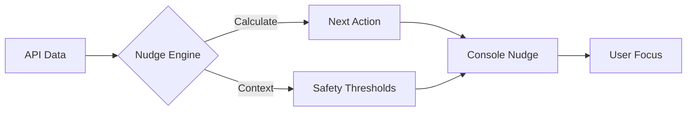
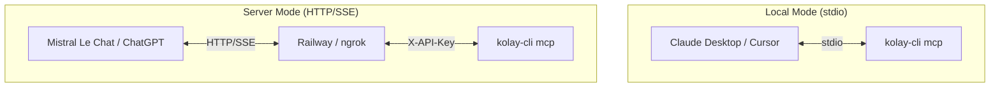

# Disclaimer and Legal Notice (Alpha Release)

1. **Unofficial Lab Application:** This project is an independent "lab/R&D" application. It is not an official product or service of Kolay İK. **Kolay Yazılım A.Ş.** cannot be held responsible for any data loss, system errors, or damages arising from the use of this software.
2. **Token and Data Security:** The creation and secure storage of API tokens are entirely the user's responsibility. Please follow Kolay İK's official instructions and security guidelines when generating tokens to prevent unauthorized access.
3. **Operational Risks:** Please use the tools and operations performed via the MCP and CLI carefully. Write/update actions and bulk operations can cause permanent changes or damage to your live HR data. 
4. **Early Development Stage (Alpha):** This application is currently in its **Alpha** stage and is under active development. It may contain unexpected bugs. You can submit any bug reports, feedback, or feature requests via the GitHub [Issues](https://github.com/ezapmar/kolay-cli/issues) page.

---

# kolay-cli

An unofficial AI-powered Command Line Interface and MCP Server for Kolay İK.

```
               ███████████████████████
              ████               ████ 
             ████               ████ 
            ████               ████          ████                             ███ 
           ███                ████           ████                             ███ 
         ████                ███             ████                             ███ 
        ████               ████              ████     █████    █████████      ███     █████████ ████  ████        ████ 
       ████               ████               ████   █████    █████████████    ███    ███████████████   ████      ████ 
      ████               ████                ████  ████     ████       ████   ███   ████       █████    ███     ████ 
       ████             ██████               ████████      ████         ████  ███  ████         ████    ████    ███ 
        ████           ████████              ████████      ████         ████  ███  ████         ████     ████  ████ 
         ████         ███   ████             ████ █████    ████         ████  ███  ████         ████      ████████ 
          ████      ████     ████            ████   ████    █████     █████   ███   █████     ██████       ██████ 
           ████    ████        ███           ████     ████    ███████████     ███     ██████████████        █████ 
             ███  ████          ████                             █████                   ████               ████ 
              ███████            ████                                                                      ████ 
               ███████████████████████                                                                  ██████ 
                █████████████████████                                                                   ███ 
```

**kolay-cli** allows you to manage your HR tasks, employee records, and company workflows directly from your terminal. It provides lightweight access to the Kolay İK API and serves as a local [Model Context Protocol (MCP)](https://modelcontextprotocol.io) server for AI assistants like Claude and Cursor.

## Key Features

*   **Natural Language HR**: Use the built-in MCP server to talk to your HR data using AI.
*   **Complete Resource Management**: Manage People, Leaves, Timelogs, Trainings, and Finance.
*   **Secure by Design**: API tokens are stored in your OS Keychain (macOS, Windows, Linux).
*   **CLI First UX**: Interactive ID pickers, human-readable tables, and guided setup.
*   **Developer Friendly**: Full JSON output mode for automation and scripting.
*   **Health Diagnostics**: Built-in `doctor` command to verify connectivity and credentials.

## Installation

Install via `pipx` (recommended) to keep dependencies isolated:

```bash
pipx install kolay-cli
```

Or via `pip`:

```bash
pip install kolay-cli
```

## Quickstart

### 1. Authenticate
Configure your session by providing your Kolay API token. You can generate a token at [app.kolayik.com/settings/developer-settings](https://app.kolayik.com/settings/developer-settings).

```bash
kolay auth login
```

### 2. Verify Health
Ensure your connection is healthy and authorized.

```bash
kolay doctor
```

### 3. Start Managing
List your colleagues or create a leave request.

```bash
# List top 10 employees
kolay person list --limit 10

# Create an annual leave request
kolay leave create --type annual --start 2026-03-01 --end 2026-03-03
```

### 🎨 Behavioral Nudge Engine

**kolay-cli** isn't just a tool; it's a personal productivity coach. It uses a built-in **Behavioral Nudge Engine** to distill your overwhelming HR tasks into actionable, time-boxed bursts.

#### How it Works:


*   **Contextual Intelligence**: Nudges appear only when relevant (e.g., after listing leaves, it reminds you of pending approvals).
*   **Safety Thresholds**: Prevents "alert fatigue" by intelligently throttling notifications based on your interaction history.
*   **Gamification**: Track your "Consistency Streak" by clearing nudges daily.

Configure your coach:
```bash
kolay nudge configure
```

Ready to crush some tasks? Start a focused micro-sprint:
```bash
kolay nudge sprint
```

*The Coach says: "You have 5 pending items in other areas. Clear them in 5 mins with `kolay nudge sprint`!"*

## MCP Server Integration

Turn your AI assistant into an HR expert. `kolay-cli` exposes its full functionality as an MCP server.

### 🔌 Connection Architecture



`kolay-cli` facilitates these interactions seamlessly:

### Local Clients (stdio)
For clients running on your machine, use the automated installer:

```bash
kolay mcp install
```

This writes the configuration into the correct file for each client. Supported local clients:

| Client | Config Path |
|---|---|
| **Claude Desktop** | `~/Library/Application Support/Claude/claude_desktop_config.json` |
| **Cursor** (global) | `~/.cursor/mcp.json` |
| **Cursor** (project) | `.cursor/mcp.json` in your working directory |
| **Windsurf** | `~/.codeium/windsurf/mcp_config.json` |
| **Gemini CLI** | `~/.gemini/settings.json` |
| **VS Code** (Copilot) | User-level `mcp.json` |
| **Zed** | `~/.config/zed/settings.json` |

Restart your client after running `kolay mcp install` to activate the connection.

### 🧠 UX-Driven AI Intelligence
The MCP server doesn't just pass raw API endpoints to the AI; it is designed with **human-in-the-loop UX** to increase reliability and trust:

* **Intent Catchers**: If you ask Claude, *"I'm feeling sick, take tomorrow off"*, the AI uses a semantic `request_time_off` tool that automatically translates human dates into strict `YYYY-MM-DD` API dates.
* **Safety Dry-Runs**: Before the AI creates a leave request, it automatically runs `analyze_leave_impact` to calculate your projected balance and present you with a safety confirmation before committing destructive actions.
* **Smart Diagnostics**: The `employee_health_check` tool enables the LLM to cross-reference an employee's upcoming leaves, excessive timelogs, and overdue training in a *single* call, preventing AI hallucinations and context drift.
* **Guided Dashboards**: Don't know what to ask? Invoke the `manager_dashboard` prompt directly in your AI client to generate an instant morning briefing for your department.

### Server Deployment (HTTP/SSE)

If you want to expose your HR data to cloud-based AI agents (like ChatGPT, Mistral Le Chat, or custom orchestrators), you can deploy `kolay-cli` as an HTTP server.

**1. Set an API Key:**
To protect your data on public URLs (e.g., Railway, Render), configure a secret environment variable. If `MCP_API_KEY` is not set, the server runs without authentication (for local dev only).

```bash
export MCP_API_KEY="your-super-secret-key"
```

**2. Start the Server:**

```bash
kolay mcp serve --transport http --port 8000
```
This starts the FastMCP server with raw ASGI middleware that intercepts all requests and ensures the `X-API-Key` header matches your secret.

### Using with Mistral Le Chat

[Le Chat](https://chat.mistral.ai) supports MCP through remote HTTP connectors. To connect your remote `kolay-cli` deployment:

1. Go to [chat.mistral.ai/connections](https://chat.mistral.ai/connections)
2. Click **Add custom connector**
3. Enter your MCP server URL (e.g. `https://your-app.up.railway.app/mcp`)
4. In the headers section, add your configured API key:
   * **Header Name**: `X-API-Key`
   * **Header Value**: `your-super-secret-key`
5. Save and start chatting with your HR data!

## Output Modes

| Flag | Description |
|---|---|
| `--json` | Returns machine-readable JSON for prompts or scripts. |
| `--yes` | Bypasses confirmation prompts for destructive actions. |
| `--debug` | Logs HTTP traces to `~/.config/kolay/debug.log`. |
